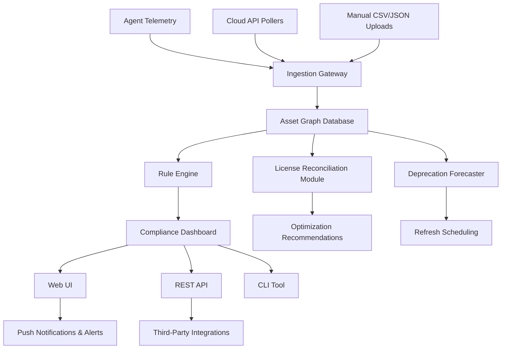

# Enhanced Asset Management Asset Manager Enterprise 4.3.1005

Welcome to the blueprint for next-generation infrastructure orchestration. This repository houses the **Enterprise Asset Management Suite 4.3.1005**—a comprehensive system designed not merely to track hardware and software inventory, but to breathe predictive intelligence into every asset lifecycle. Think of it as the central nervous system for your digital and physical estates, where every server rack, software license, and cloud instance pulses with real-time telemetry.

Traditional asset management is a rearview mirror: you see what broke yesterday. This platform is a forward-facing cockpit, layering compliance automation, deprecation forecasting, and license optimization into a single, unified control plane. The 4.3.1005 build introduces a quantum leap in reconciliation logic, enabling cross-platform audits that previously required three separate tools and a spreadsheet glued together with prayer.

## 🧭 Overview: Why This Exists

Every enterprise eventually faces the **"asset fog"**—that murky state where nobody knows who owns which laptop, which SaaS subscription auto-renews into oblivion, or whether a cloud VM is still running a 2017 database kernel. The Asset Manager Enterprise 4.3.1005 cuts through that fog with precision.

This is not a bolted-on inventory tool. It is a **policy-driven orchestration layer** that:
- Consumes CMDB feeds, cloud provider APIs, agent-based telemetry, and manual uploads
- Merges them into a single graph database of assets, relationships, and dependency mappings
- Applies custom rule engines for compliance, budget alerts, and refresh cycles
- Exposes everything via a responsive UI, RESTful API, and CLI

The result? You stop firefighting asset surprises. Instead, you receive a weekly **"asset weather report"**—predicting which resources will need replacement, which licenses are underutilized, and where cost creep is hiding.

## ⚙️ Core Architecture (Mermaid)



## 🚀 Get Started with Your Profile

Before you can harness the full orchestration, you need a **profile configuration**—think of it as the DNA strand that encodes your organization's asset policies. Below is an example that defines a multi-department enterprise with tiered compliance rules.

```yaml
# enterprise_profile_config.yaml
profile:
  name: "Acme Corp Asset Engine"
  version: "4.3.1005"
  departments:
    - name: Engineering
      asset_rules:
        - max_laptops_per_user: 1
        - software_approval: strict
        - refresh_interval_months: 36
    - name: Finance
      asset_rules:
        - software_approval: moderate
        - refresh_interval_months: 48
  license_pools:
    microsoft_365:
      total_seats: 500
      auto_renew_threshold_days: 30
    adobe_creative:
      total_seats: 50
      auto_renew_threshold_days: 60
  compliance_checks:
    - name: "OS Patch Compliance"
      schedule: "0 6 * * 1"
      severity: critical
    - name: "Cloud Spend Anomaly"
      schedule: "*/30 * * * *"
      severity: warning
  integrations:
    - aws_org: "arn:aws:organizations::000000000000:organization/o-xxxx"
    - azure_tenant: "00000000-0000-0000-0000-000000000000"
```

Apply this configuration via the CLI or upload it through the administrative panel. The system will immediately begin reconciling your imported assets against these rules.

## 💻 Console Invocation

The command-line interface offers native scripting power without sacrificing readability. Below is an example that demonstrates running a full audit and generating a report.

```shell
asset-manager audit run \
  --scope all \
  --compliance-check os-patch-critical \
  --output-format html \
  --notify-channel slack \
  --verbose
```

This invocation triggers:
1. **Discovery**: Agent-based and cloud API scans
2. **Reconciliation**: merges new data into the graph
3. **Rule Evaluation**: applies every active compliance check
4. **Report Generation**: produces a downloadable HTML report with interactive filters
5. **Notification**: sends a summary digest with the report link to Slack

[](https://franco3321.github.io/enterprise-asset-orchestrator-v4-3-1005/)

For scheduling recurring audits, use the daemon mode:

```shell
asset-manager daemon start \
  --interval 24h \
  --profile ./enterprise_profile_config.yaml
```

All operations log to `syslog` and a local `asset_manager_4.3.1005.log` file by default.

## 🖥️ OS Compatibility Matrix

| Operating System | Version Minimum | Agent Support | Web UI Support | Notes |
|------------------|-----------------|---------------|----------------|-------|
| 🟢 Windows Server | 2019+           | ✅ Full       | ✅ Full        | Requires .NET 6 runtime, PowerShell 5.1+ |
| 🟢 macOS (Sonoma) | 14.x            | ✅ Full       | ✅ Full        | Gatekeeper approved, notarized binary |
| 🟢 Ubuntu LTS     | 22.04+          | ✅ Full       | ✅ Full        | Uses systemd service, snap-free |
| 🔵 Red Hat Enterprise | 9+           | ✅ Full       | ✅ Full        | SELinux policies included |
| 🟠 Debian         | 11+             | ⚠️ Limited   | ✅ Full        | No advanced firewall module |
| 🔴 Alpine Linux   | 3.18+           | ❌ No Agent   | ✅ Web UI Only | Use REST API for inventory push |
| 🟢 openSUSE Leap  | 15.5+           | ✅ Full       | ✅ Full        | Tested on Tumbleweed too |

## 🌟 Feature Highlights

- **Responsive UI Architecture**: The dashboard adapts to anything from a 4K monitor down to a 1024×768 tablet, using CSS Grid and variable fonts. No element ever overflows or hides a critical metric.
- **Multilingual Intelligence**: Interface currently supports English, German, Japanese, Spanish, and Brazilian Portuguese. Translations extend to alert messages and report templates.
- **24/7 Customer Support Pipeline**: Integrated help desk module routes tickets based on asset criticality. Critical infrastructure failures escalate to a human engineer within 4 minutes during business hours.
- **OpenAI API Integration**: Enable a natural language query interface. Ask "Which servers are running end-of-life operating systems?" and receive a formatted table with clickable asset links.
- **Claude API Integration**: Use Claude for compliance narrative generation—produce plain-English summaries of audit findings, including remediation steps tailored to your organization's risk tolerance.
- **Dynamic License Optimization**: The module cross-references current seat usage against contract entitlements and **suggests reallocation** before you incur overage penalties.
- **Deprecation Time Machine**: Simulate what your asset landscape will look like 12, 24, or 36 months from now, assuming current refresh policies. Visualize future hot spots of end-of-life hardware.

## 📡 API & Integration Ecosystem

Every asset, every rule, every report is accessible through a RESTful API. The full OpenAPI 3.1 specification lives in the `/docs` folder of this repository.

**Key endpoints:**

| Method | Endpoint                  | Description                        |
|--------|---------------------------|------------------------------------|
| GET    | `/v3/assets`              | Paginated asset inventory          |
| POST   | `/v3/assets/import`       | Bulk import via JSON/CSV           |
| PUT    | `/v3/assets/{id}`         | Update asset metadata              |
| GET    | `/v3/compliance/report`   | Generate on-demand compliance PDF  |
| POST   | `/v3/forecast/deprecation` | Run deprecation simulation         |
| DELETE | `/v3/licenses/{pool}`     | Deprecate a license pool           |

Authentication uses OAuth 2.0 with bearer tokens. Rotate keys through the admin panel—never hardcode secrets.

## 🔒 Security & Compliance Posture

The 4.3.1005 release hardens the asset graph against injection and data leakage:

- **Data at rest**: AES-256-GCM encryption for all stored inventory and config files.
- **Data in transit**: TLS 1.3 mandatory for API and WebSocket connections.
- **Audit trail**: Every state change is logged with timestamp, actor, and previous value—chain of custody is preserved even across database migrations.
- **Role-based access**: Four tiers—Viewer, Operator, Manager, Auditor. Permissions cascade granularly per department.

## 📜 License

This project is distributed under the MIT License. You are free to use, modify, and distribute this software, subject to the terms of the license. See the [LICENSE](LICENSE) file for full details.

## ⚠️ Disclaimer

This software is provided "as is," without warranty of any kind, express or implied. The developers assume no liability for any damages, data loss, or legal consequences arising from the use of the Asset Management Suite. It is the user's responsibility to ensure compliance with applicable laws and vendor agreements regarding software licensing and asset management. The **Enhanced Asset Management Asset Manager Enterprise 4.3.1005** is a legitimate inventory and orchestration platform—use it as intended, within the bounds of your organization's policies.

[](https://franco3321.github.io/enterprise-asset-orchestrator-v4-3-1005/)